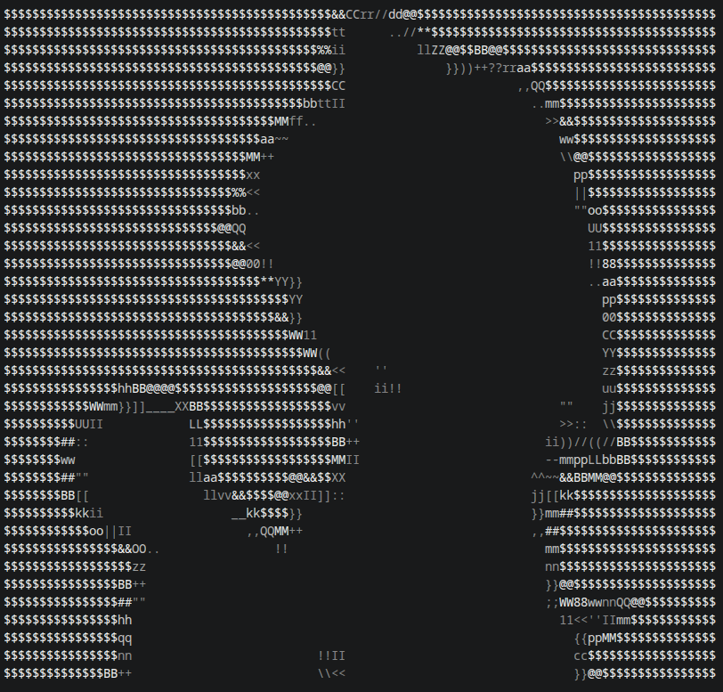
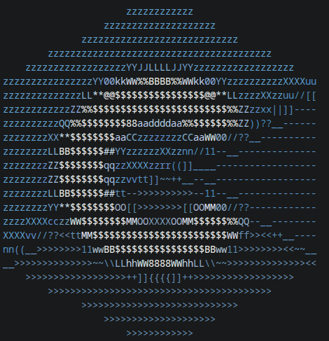
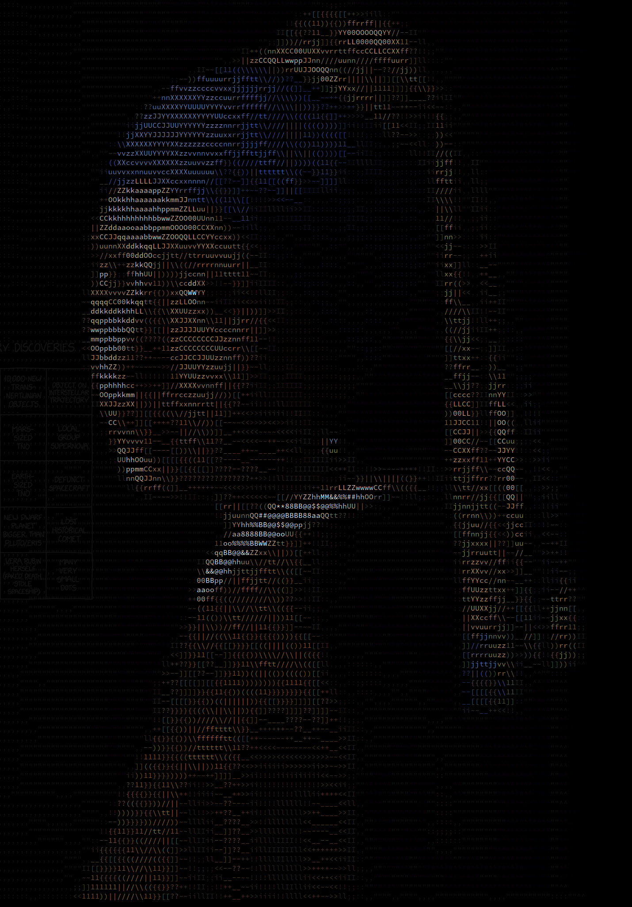
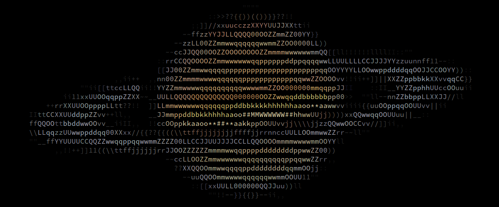

# Terminal image to ascii

## Features

- Color quantization – reduce the image to a custom number of colors (default 32)
- Scaling
- ASCII or block mode – choose between character‑based art or blocks.
- Monochrome mode
- Brightness adjustment
- Lift black – replace the darkest colors with spaces

## Requirements

- C compiler
- ImageMagick
- Libraries
  - `stb_image`
  - `stb_image_resize2`
  - `stb_image_write`

## Installation

1. Clone the repository
2. Compile with  
   `gcc -g -O0 -fsanitize=address -fno-omit-frame-pointer main.c -lm -o main`
3. Run  
   `./main`

## Examples

- Scale to 5%, use 64 colors  
   `./main ../saturn.png -s 0.05 -c=64`
- Block display
  `./main ../img/c_logo.png -s=0.05 -n`
- Monochrome with lifted blacks
  `./main ../img/girl.png -s=0.01 -m -l 6`

## Gallery

